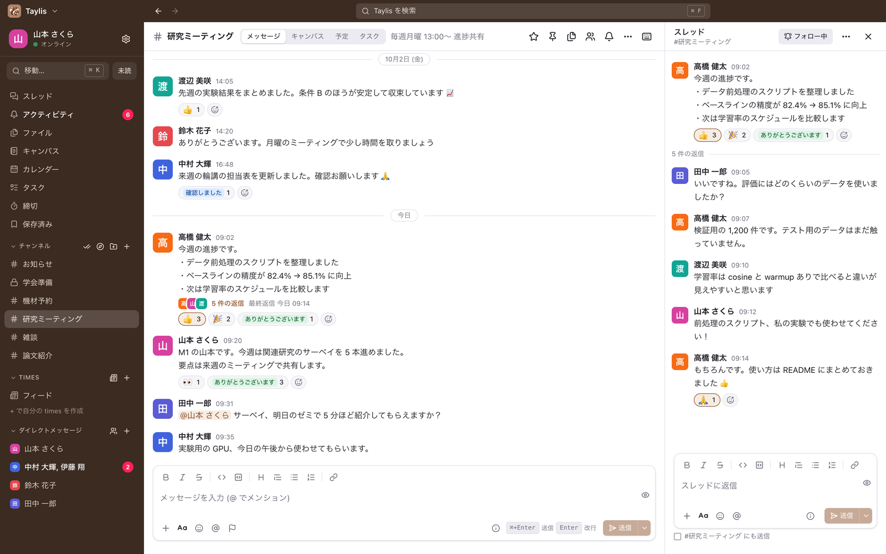
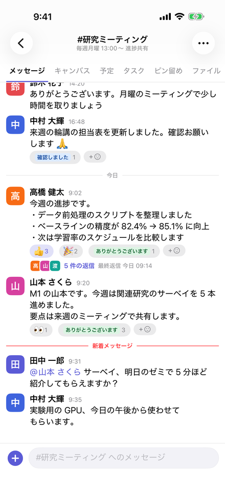

# Taylis

[English](README.md)

Taylis(テイリス)は、研究室や小さなチームのためのセルフホスト型チャットです。サーバーを自分たちで用意して動かし、
Windows・macOS・iOS・Android のアプリと、ブラウザから使います。Slack に近い使い心地を目指しています。

(旧名は「ChikuwaChat」です。バンドル ID・パッケージ名・`chikuwachat://` の URL スキームなど、内部の識別子には古い名前が残っています。)

> **サポートの保証はありません。** Taylis は作者が自分たちで使うために開発し、そのままの形で公開しています。
> Issue やプルリクエストは歓迎しますが、対応・修正・今後の予定はお約束できません。[CONTRIBUTING.md](CONTRIBUTING.md) をご覧ください。

<p>
  
  
</p>

## 主な機能

- 公開・非公開のチャンネル、DM、グループ DM
- スレッド、リアクション、メンション、編集と削除。未読の位置は端末の間で同期します
- 確実な配送: サーバーでの順序付け、再送しても重複しない送信、再接続後の取りこぼしの回収 (WebSocket + REST、
  [docs/SYNC_PROTOCOL.md](docs/SYNC_PROTOCOL.md))
- APNs (iOS) と FCM (Android) によるプッシュ通知。トランザクショナル・アウトボックスから送ります
- 日本語と英語の全文検索 (PostgreSQL + PGroonga)
- S3 互換のオブジェクトストレージへのファイル添付 (標準は versitygw)
- Canvas (共有の文書)、繰り返しの予定と iCal に対応したカレンダー、タスク、ワークフロー、カスタム絵文字とスタンプ
- 共有の機材やアカウントの順番待ち (予約)
- Google でのログイン (組織のドメインに限定できます)、招待、ゲスト
- 1 つのアプリで複数のサーバーを切り替え
- Mattermost と Slack のエクスポートの取り込み
- 必要に応じて AI のボット (メンションへの返答、要約、過去のメッセージへの質問。[docs/AI.md](docs/AI.md))
- バックアップと復元のスクリプト、リリースのタグからの自動デプロイ

## 構成

モジュラーモノリスです。**FastAPI** (Python) + **PostgreSQL** と **PGroonga** + **versitygw** (S3 互換の
オブジェクトストレージ) を Docker Compose で動かし、Caddy (または既存のリバースプロキシ) の後ろに置きます。
Redis・Kafka・Kubernetes は使いません。詳しくは [docs/ARCHITECTURE.md](docs/ARCHITECTURE.md) をご覧ください。

## サーバーを立てる

Docker Engine と compose プラグインの入った Linux サーバー (2 vCPU / メモリ 4 GB 以上) と、そのサーバーを指す
ドメイン名 (ポート 80 と 443 を開けたもの) が必要です。

```sh
git clone https://github.com/kanotown/taylis.git /srv/chikuwachat
cd /srv/chikuwachat/infra
cp .env.example .env && chmod 600 .env     # SECRET_KEY, POSTGRES_PASSWORD, S3_SECRET_KEY, CHAT_DOMAIN を設定
docker compose -f docker-compose.yml -f docker-compose.prod.yml --profile proxy up -d --build
docker compose -f docker-compose.yml -f docker-compose.prod.yml exec app python -m app.cli create-admin --username admin
```

ブラウザで `https://<CHAT_DOMAIN>/` を開くか、デスクトップやスマートフォンのアプリにその URL を入れてください。
バックアップと復元、プッシュ通知 (APNs / FCM) の設定、既存のリバースプロキシの後ろでの運用、自動デプロイ、
取り込みについては [infra/README.md](infra/README.md) に書いてあります。

## アプリ

| アプリ | 技術 | 備考 |
| --- | --- | --- |
| ブラウザ | React (サーバーが配信) | `https://<CHAT_DOMAIN>/` |
| デスクトップ | Tauri 2 + React | Windows と macOS。公式のリリースからアプリ内で更新 |
| iOS | SwiftUI | APNs でプッシュ。Xcode でビルド ([docs/DEVELOPMENT.md](docs/DEVELOPMENT.md)) |
| Android | Jetpack Compose | FCM でプッシュ。Gradle でビルド |

どのアプリも、同じ API ([openapi/openapi.json](openapi/openapi.json)) でサーバーとやり取りします。

## 開発

- [docs/DEVELOPMENT.md](docs/DEVELOPMENT.md): 開発環境、チェックのコマンド、フォークでのビルド
- [docs/IMPLEMENTATION_PLAN.md](docs/IMPLEMENTATION_PLAN.md): マイルストーン。残りは [docs/BACKLOG.md](docs/BACKLOG.md)
- 設計の文書は、ほとんど日本語で `docs/` にあります

**管理者に見えるもの**: メンバーでない管理者は、アプリから非公開チャンネルや DM を読めません。ただし、サーバー・
データベース・バックアップにアクセスできる人は、技術的にはすべてのメッセージを読めます。利用者にそのことを伝え、
管理者やサーバーの担当を誰にするかを考えてください ([docs/LAB.md](docs/LAB.md) J)。

## セキュリティ

脆弱性は、公開の場ではなく非公開で報告してください。[SECURITY.md](SECURITY.md) をご覧ください。

## ライセンス

ソースコードは [Apache License 2.0](LICENSE) です。同梱している第三者のデータは
[THIRD_PARTY_NOTICES.md](THIRD_PARTY_NOTICES.md) にまとめています。

「Taylis」の名前とリスのアイコン・ロゴは、Apache License の対象**外**です。フォークでは別の名前とアイコンを
使ってください。[TRADEMARKS.md](TRADEMARKS.md) と [NOTICE](NOTICE) をご覧ください。
