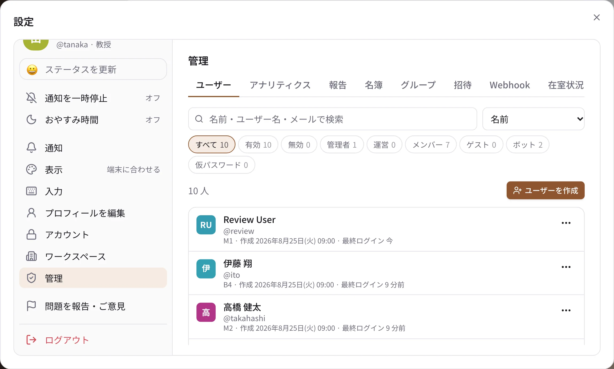

# 管理者

ワークスペースの管理者（ロール `admin`）と運営（`manager`）のための説明です。管理の画面は、デスクトップ版とブラウザ版の
設定 →「管理」にあります（スマートフォンのアプリには管理の画面はありません）。運営には、日々の管理に要るタブだけが出ます
（[ロールと権限](roles.md)）。

{ .wide }

!!! tip "最初の管理者"
    最初の管理者は、サーバーで `create-admin` のコマンドで作ります（[クイックスタート](../self-hosting/quickstart.md)）。
    2 人目からは、管理画面でほかの人を管理者にできます。管理者が 1 人だけだと、その人が休んだときに困るので、
    2 人以上にしておくのがおすすめです。

## 管理画面のタブ

| タブ | できること | 説明 |
| --- | --- | --- |
| ユーザー | 作成・ロールの変更・無効化・ユーザー名の変更・2 要素認証の解除・削除（匿名化） | [ユーザーと招待・SSO](users.md) |
| アナリティクス | メンバーの最終ログイン・最終利用、日ごとのメッセージ数と利用している人数、CSV の書き出し | [アナリティクス](analytics.md) |
| 報告 | メンバーからの報告の確認と「対応済み」 | [報告とモデレーション](moderation.md) |
| 名簿 | 研究室の名簿（身分・学年・指導教員など） | — |
| グループ | `@グループ名` でメンションできるグループ | [ユーザーと招待・SSO](users.md#groups) |
| 招待 | 招待リンクの発行・取り消し | [ユーザーと招待・SSO](users.md#invites) |
| Webhook | 外のサービスからチャンネルに投稿する URL | [チャンネル](channels.md#webhooks) |
| 在室状況 | 在室状況の有効化、状態、自分用の状態の規則、外のサイトとの連携 | [在室状況と操作ボタン](attendance.md) |
| 操作ボタン | 外の機器を動かすボタンと中継、押せる人、記録 | [在室状況と操作ボタン](attendance.md#actions) |
| ワークフロー | フォームから決まった形の投稿をする仕組み | [チャンネル](channels.md#workflows) |
| AI | AI のボットと今月の使用量（サーバーで AI を有効にしたときだけ） | [AI](ai.md) |
| 設定 | ワークスペースのアイコン、既定のチャンネル、参加・退出の表示など | [ワークスペースの設定](workspace.md) |
| チャンネル | すべてのチャンネルの一覧、名前の変更、アーカイブ、times の指定 | [チャンネル](channels.md) |
| 絵文字 | カスタム絵文字と絵文字のセット | [カスタム絵文字とセット](emoji.md) |
| キャンバス | ワークスペース共通のキャンバスのテンプレート | — |
| ドキュメント | すべてのページの題名と共有の一覧、引き取り、完全削除 | [ドキュメントの管理](docs.md) |

共有の枠の予約の設定は、管理画面ではなくサイドバーの「予約」から行います（[予約の枠](reservations.md)）。

## 管理者に見えるもの・見えないもの

メンバーでない管理者は、アプリから非公開チャンネルや DM を読めません。ただし、サーバーやデータベースを扱える人は
技術的にはすべてのメッセージを読めます。管理の操作は監査ログ（誰が・いつ・何に・何をしたか）に残ります。
詳しくは [プライバシーとデータの扱い](../privacy.md#admins) をご覧ください。
