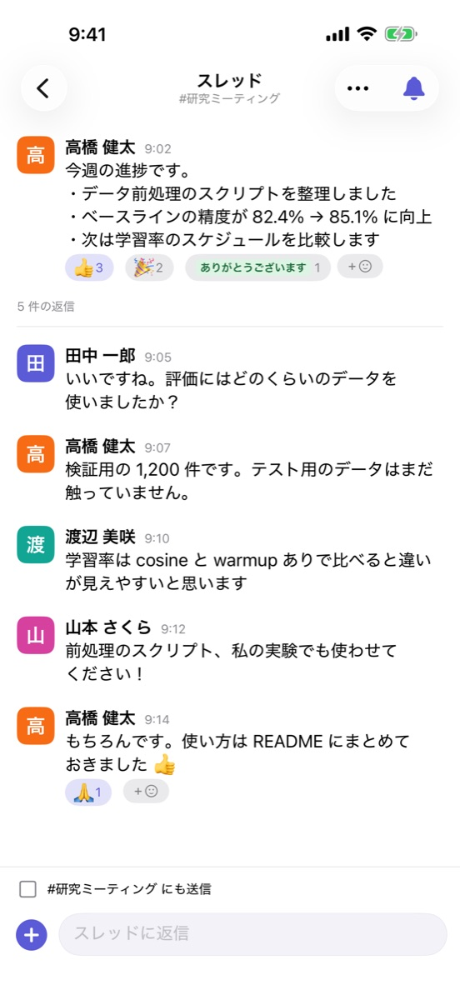
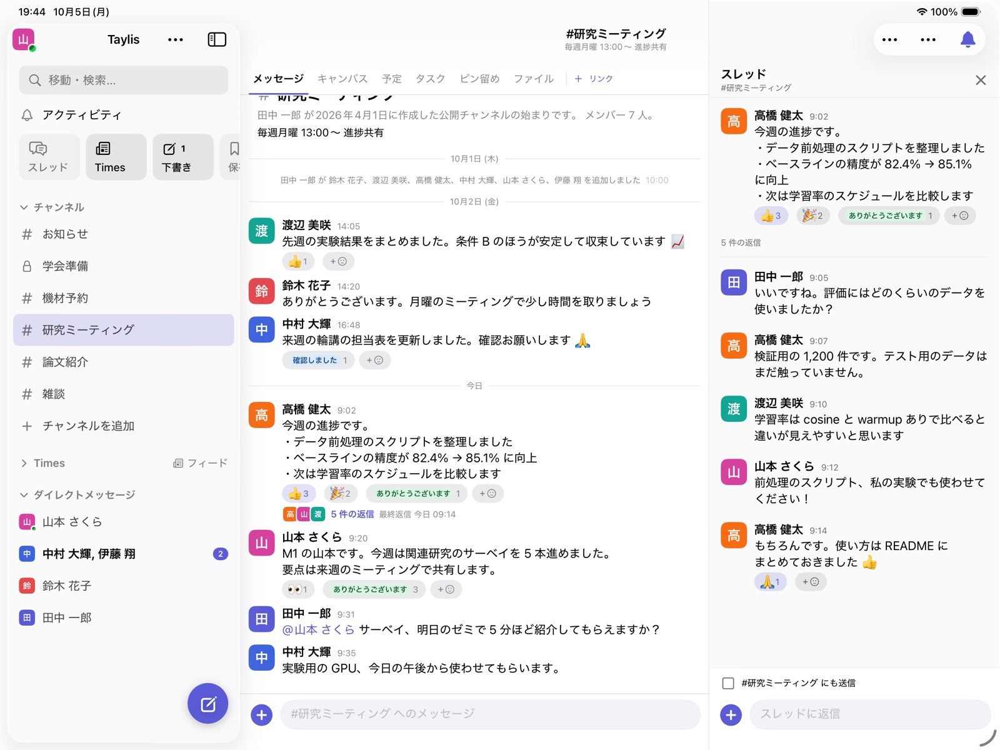
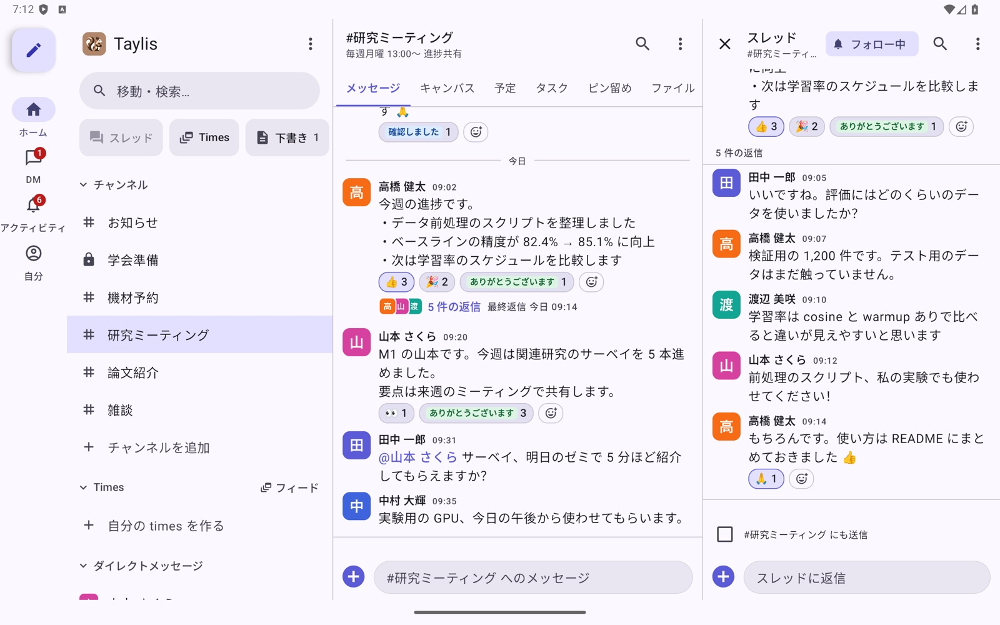

# 機能

Taylis の機能を分野ごとに挙げます。断り書きのない機能は、デスクトップ版・ブラウザ版・iOS・Android のどれでも
使えます。一部の設定画面はデスクトップ版とブラウザ版にしかありません。

## 会話

{ .phone }
{ .phone }

- **チャンネル**：誰でも参加できる公開チャンネルと、招かれた人だけの非公開チャンネル。トピックと説明、ピン留め、
  アーカイブ。管理者の設定によっては、参加する前に公開チャンネルの中をのぞけます。
- **DM とグループ DM**：1 対 1 と、数人でのダイレクトメッセージ。
- **スレッド**：メッセージへの返信をスレッドにまとめます。「チャンネルにも送信」で返信をチャンネルにも出せます。
  参加したスレッドはフォローされ、新しい返信が「スレッド」の一覧に届きます。
- **メンション**：`@名前`、グループへのメンション、`@channel` / `@here`。キーワードを登録すると、その言葉を含む
  メッセージも通知されます。
- **編集と削除**：送ったメッセージを直したり消したりできます。編集の履歴も見られます。
- **下書き・保存済み・リマインダー**：書きかけの文は端末の間で同期します。あとで読みたいメッセージを保存したり、
  時間を決めて思い出させたりできます。
- **確認のお願い**：「確認しました」を集めたい投稿で、誰が確認済みかを見られます。
- **テンプレート**：日報や週報など、決まった形の文を `/名前` で入力欄に入れられます。
- **未読の同期**：どこまで読んだかはサーバーが覚えていて、パソコンで読んだ分はスマートフォンでも既読になります。

書き方は [メッセージの書き方](guide/formatting.md) をご覧ください。

## リアクションと絵文字

- **リアクション**：標準の絵文字（Unicode 17 のすべて）とカスタム絵文字でリアクションできます。絵文字は日本語の
  キーワード（「ありがとう」など）でも探せます。
- **文字の絵文字**：「確認しました」「ありがとうございます」のような短い言葉を、色付きのラベルとして使えます。
- **横長の絵文字**：横長の画像も潰さずに表示します。
- **絵文字のセット（スタンプ）**：オリジナルの絵文字をセットにまとめ、ピッカーのタブとして使えます。セットの絵文字
  1 つだけのメッセージは、スタンプとして大きく表示されます。
- **大きな絵文字**：絵文字だけのメッセージは大きく表示されます。

詳しくは [絵文字とリアクション](guide/emoji.md)、管理者向けは [カスタム絵文字とセット](admin/emoji.md) をご覧ください。

## 検索

- 日本語と英語のメッセージを全文検索できます（PostgreSQL + PGroonga）。
- 送信者・チャンネル・期間・種類で絞り込み、関連度順か新しい順で並べます。
- ファイルとキャンバスも検索できます。`is:times` で Times（作業ログ）だけに絞れます。
- 管理者が AI を有効にしたサーバーでは、検索画面から「AI に聞く」で過去のメッセージに質問できます（下の「AI」）。

## ファイルと文書のプレビュー

- 写真・動画・ファイルを添付できます（既定の上限は 1 ファイル 100 MB。サーバーの設定で変えられます）。
- 画像はサムネイル、動画は縦横と長さとポスターの画像付きで表示します。
- **PDF と Office の文書**（Word・Excel・PowerPoint・OpenDocument・RTF）は、1 ページ目のサムネイル付きのカードで
  表示し、アプリの中のビューアで全ページを見られます。
- 本文の URL には、リンク先のプレビューが付きます。

## 投票と日程調整

{ .phone }

- **投票**：メッセージに投票を付けられます（単一選択・複数選択、誰が投票したかの表示）。
- **日程調整**：調整さんのように、候補の日時ごとに ○ △ × で答えてもらい、集計を表で見られます。決まった日時は
  そのままチャンネルのカレンダーの予定にできます。

## カレンダー・タスク・締切

- **カレンダー**：自分用のカレンダーと、チャンネルの共有カレンダー。繰り返しの予定、予定の通知、iCal での購読
  （ほかのカレンダーアプリから見る）に対応しています。
- **タスクとカンバン**：自分用のリストと、チャンネルごとの共有のボード（未着手 / 進行中 / 完了）があります。
  担当者は複数人にでき、期限が近づくと通知されます。メッセージからタスクを作ったり、期限をカレンダーに出したり
  できます。DM のメッセージからは「レビューを依頼」でタスクを作れます。
- **締切**：学会の原稿や提出物などの締切をチャンネルに登録すると、チャンネルの見出しに「あと 3 日」のように出て、
  7 / 3 / 1 / 0 日前にお知らせが投稿されます。

## キャンバス

- チャンネルや DM に付ける共有の文書です（Slack のキャンバスに近いものです）。
- 自動で保存され、何人かで同時に書いてもサーバーがまとめます。版の履歴とゴミ箱があります。
- 見出し・箇条書き・チェックリスト・表・画像を書けます。チェックリストの行からタスクを作れます。
- キャンバスの中でメンションされると通知されます。誰が編集中かも表示されます。

## 定期投稿・ワークフロー・フィード

- **定期投稿と提出の回収**：「毎週月曜に週報のスレッドを立てる」のような定期の投稿。スレッドへの返信で提出してもらい、
  「提出 7/10」のように状況を見られます。締切を過ぎたら、まだの人にだけ催促します。
- **ワークフロー**：フォームに入力すると、決まった形のメッセージを投稿します（ゼミの案内、欠席の連絡、書誌情報の
  報告など）。
- **フィード（RSS / Atom）**：ブログなどのフィードをチャンネルに登録すると、新しい記事をボットが投稿します。
- **Webhook**：外のサービスからチャンネルに投稿できます。

## Times（作業ログ）

- 一人ひとりが自分の「times」チャンネルを持ち、作業の記録やつぶやきを書けます。
- 参加している times の投稿を新しい順に 1 本の流れで読める「フィード」があります。
- ほかの人の times は、メンションされたときだけ未読と通知になります（その times の通知を「すべて」にすれば、
  ふつうのチャンネルと同じになります）。

## 共有の枠の予約

- 共有の機材・計算機・アカウントのシートのように、数に限りのあるものを時間で予約できます。
- 「予約する」（毎時 0 分から 1 時間単位、2 週間先まで）と、今すぐ使いたいときの「今すぐ（順番待ち）」。
- 担当者には、割り当てや入れ替えの作業がアクティビティとプッシュで届きます。

詳しくは [予約](guide/reservations.md) と、管理者向けの [予約の枠](admin/reservations.md) をご覧ください。

## 通知

- **プッシュ通知**：iOS は APNs、Android は FCM。デスクトップ版はアプリが OS の通知を出します。
- 会話ごとに通知のレベル（すべて / メンションのみ / 通知しない）を選べます。ミュートと 8 時間のミュートもあります。
- **通知を一時停止** と **おやすみ時間**（毎日決まった時間帯は通知しない）。
- 別の端末で使っている間は、スマートフォンに通知しません。すでに読んだメッセージの通知も送りません。
- **テスト通知**：設定の「通知」から、自分の端末に通知が届くかを確かめられます。

設定の方法は [通知の設定](guide/notifications.md) をご覧ください。

## 複数のワークスペース

- 1 つのアプリに、いくつもの Taylis サーバー（ワークスペース）を登録して切り替えられます。
- 開いていないワークスペースの未読もバッジで分かります。通知を押すと、そのワークスペースが開きます。
- ワークスペースごとにアイコンが付き、並べ替えもできます。

## 安全と管理

- **アカウント**：管理者がユーザーを作るか、招待リンクを発行します。ゲスト（参加できる範囲を絞った人）も作れます。
- **ログイン**：パスワード（Argon2id で保存）と、2 要素認証（認証アプリ）。サーバーの設定で、組織の Google
  アカウントでもログインできます（許可したドメインだけ）。
- **報告とブロック**：不適切なメッセージを管理者に報告できます。相手をブロックすると、その人のメッセージは
  折りたたまれ、通知も来なくなります。
- **アカウントの削除**：設定からいつでも自分のアカウントを削除できます。

詳しくは [報告とモデレーション](admin/moderation.md) と [セキュリティ](how-it-works/security.md) をご覧ください。

## AI（任意）

管理者が API キーを置いて有効にしたサーバーだけで使えます。何も設定しなければ、AI の機能は出てきません。

- **AI のボット**：管理者が名前・性格・モデルを決めたボットを作り、チャンネルで `@名前` とメンションすると、
  会話を読んでスレッドに返事をします。
- **要約**：未読・スレッド・直近 1 日 / 7 日を要約します。結果は頼んだ人にだけ見えます。
- **AI に聞く**：全文検索で見つけた過去のメッセージをもとに、出典付きで質問に答えます。
- モデルは Anthropic（Claude）と OpenAI から、ボットごとに選べます。AI を使うと、会話の一部がそのサービスに
  送られます（送り先は画面に表示されます）。月の予算と、1 人あたりの 1 日の回数に上限があります。

管理者向けの説明は [AI](admin/ai.md) をご覧ください。

## 移行（Slack / Mattermost）

- **Slack**：ワークスペースのエクスポート（ZIP）から、チャンネル・メッセージ・スレッド・リアクション・ピン留め・
  添付ファイルを読み込めます。
- **Mattermost**：チームの公開・非公開チャンネルを、会話ごと読み込めます。
- どちらも試し読み（`--dry-run`）で確かめてから実行でき、もう一度実行しても重複しません。

手順は [Slack / Mattermost からの移行](self-hosting/import.md) をご覧ください。

## デスクトップ版

- Windows と macOS。アプリの中で新しい版に更新できます（「更新して再起動」）。
- ライト / ダーク、テーマの色（Taylis（栗）・藍・緑・紫・紅・グレー）、濃いサイドバー / 明るいサイドバー。
- フォントは同梱の Noto Sans JP（システムのフォントにも切り替えられます）。
- 文字の大きさ：++ctrl+plus++ / ++ctrl+minus++ / ++ctrl+0++（macOS は ++cmd++）で 80〜200%。
- 戻る / 進むのボタンと、キーボードで開く「移動・検索」。
- ブラウザ版はデスクトップ版と同じ画面で、サーバーの URL を開くだけで使えます。

## スマートフォンとタブレット

{ .tablet }
{ .tablet }

- iPhone と Android のアプリには、ホーム・DM・アクティビティ・自分の 4 つのタブがあります。
- **iPad** と **Android タブレット** では、サイドバー・会話・スレッドを並べた広い画面になります。ハードウェア
  キーボードのショートカットにも対応しています。
- 一度読み込んだメッセージは端末に保存されるので、アプリを開くとすぐに表示され、その後でサーバーと同期します。
