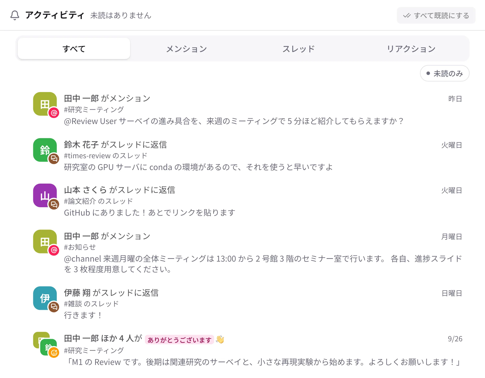

# アクティビティと未読

{ .wide }

## アクティビティ

サイドバーの「アクティビティ」（スマートフォンは下の「アクティビティ」タブ）に、自分に関係することが新しい順に集まります。

- 自分へのメンション、グループや `@channel` へのメンション、登録したキーワード
- フォローしているスレッドへの返信
- 自分のメッセージへのリアクション
- キャンバスやドキュメントでのメンション、ページの共有
- タスクの割り当てと期限、予約の担当者への知らせ

上のタブで「メンション」「スレッド」「リアクション」に絞れます。「未読のみ」で、まだ開いていないものだけになります。
項目を開くと既読になります。まとめて既読にするときは右上の「すべて既読にする」です。

## 未読の見かた

- サイドバーで **太字** の会話は未読があり、**赤い数字** は自分あてのメンション（DM は未読の数）です。
- 会話を開くと、前回読んだところに「新着メッセージ」の線が出ます。
- どこまで読んだかはサーバーが覚えているので、パソコンで読んだ分はスマートフォンでも既読になります。
- サイドバーの上の「未読」を押すと、未読のある会話だけを表示します。
- 読み直したいメッセージは、⋯ →「ここから未読にする」で未読に戻せます。
- ほかの人の Times は、メンションされたときだけ未読になります（[Times](times.md)）。

## サイドバーの一覧

| 項目 | 中身 |
| --- | --- |
| スレッド | フォローしているスレッド。新しい返信のあるものが上 |
| 下書き | 送っていない書きかけと、予約送信（「後で送信」）のメッセージ。中身があるときだけ出ます |
| リマインダー | 「リマインド…」を付けたメッセージ。中身があるときだけ出ます |
| 保存済み | 🔖 で保存したメッセージ |
| ファイル | 参加している会話に共有されたファイル |

使わない項目は隠したり並べ替えたりできます（[サイドバーと表示](sidebar.md)）。
