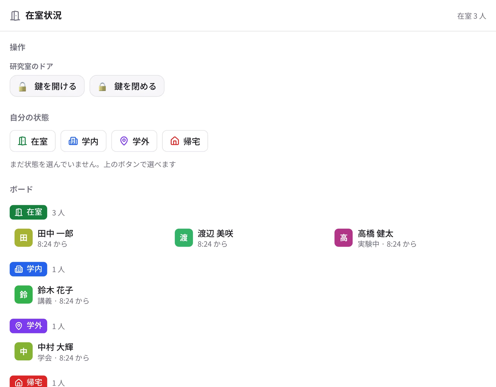

# 在室状況と操作ボタン

どちらも管理者が有効にしたワークスペースだけに出る機能です。

{ .wide }

## 在室状況

今どこにいるかを、ワンタップでみんなに知らせます。研究室に誰がいるかが、部屋に行かなくても分かります。

1. サイドバーの「在室状況」（スマートフォンはホームのタイル）を開きます。デスクトップ版は、左上のワークスペース名の横の
   丸いボタンからも切り替えられます。
2. **自分の状態** のボタン（例：在室・学内・学外・帰宅）を押します。必要なら「メモ」（「実験中」「15 時に戻ります」など）を添えます。
3. 下の **ボード** に、状態ごとのメンバーが出ます。プロフィールやメンバーの一覧にも、今の状態が小さく出ます。

- 管理者が許していれば、「自分用の状態を追加」で自分だけの状態（「会議」「出張」など）を足せます。
- 状態の名前や色は、ワークスペースごとに管理者が決めます。研究室の Web サイトの在室ボードなどと連動していることもあります。

## 操作ボタン { #actions }

研究室のドアの鍵のように、外の機器をワンタップで動かすボタンです。サイドバーの「操作」か、在室状況の画面の上に並びます。

1. ボタン（例：「鍵を開ける」）を押します。
2. 確かめの画面で「実行」を押すと、すぐに 1 回だけ実行され、結果（「解錠しました」など）が表示されます。
3. 機器の今の状態（施錠中など）が分かるボタンでは、見出しの下に状態と確かめた時刻が出ます。

押せる人は管理者が決めます（押せないボタンは出ません）。誰がいつ押したかは記録に残ります。

設定は [在室状況と操作ボタン（管理者）](../admin/attendance.md) をご覧ください。
