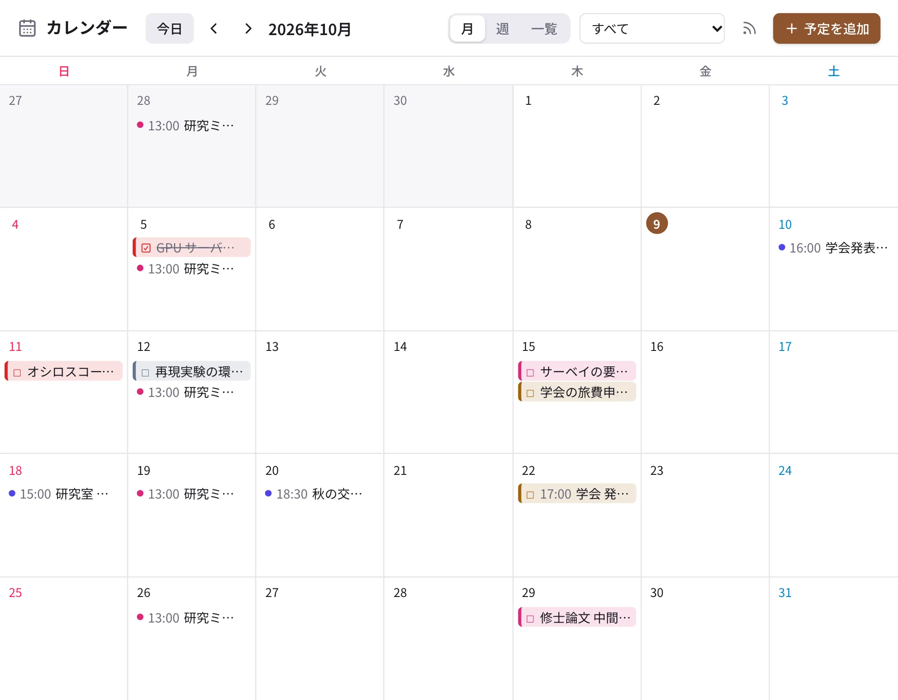
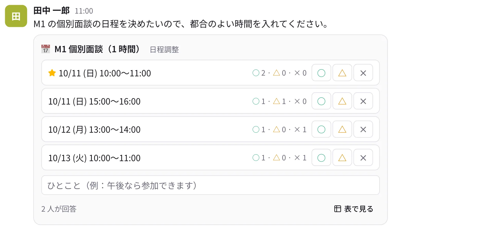

# カレンダーと日程調整

{ .wide }

## カレンダー

サイドバーの「カレンダー」に、自分の予定・参加しているチャンネルの予定・タスクの期限がまとめて出ます。右上で「月」「週」
「一覧」を切り替え、絞り込みの欄で表示するカレンダーを選べます。

### 予定を入れる

1. 右上の「予定を追加」を押します。
2. 題名・日時・場所を入れ、**追加先**（自分だけ / チャンネル）を選びます。チャンネルの予定は、そのチャンネルのメンバー
   全員に見えます。
3. 必要なら **繰り返し**（毎週の研究ミーティングなど）と **通知**（何分前に知らせるか）を決めて保存します。

チャンネルの見出しの「予定」タブでも、そのチャンネルの予定を見たり足したりできます。

### ほかのカレンダーアプリで見る（iCal）

カレンダーの右上の購読のボタン（電波のアイコン）→「購読 URL を作る」で、iCal の URL を発行できます。Google カレンダーや Apple のカレンダーに URL を登録すると、
Taylis の予定がそちらにも出ます。URL を知っている人は誰でも見られるので、人に渡さないでください（いつでも作り直せます）。

## アンケート

1. 入力欄の ＋ →「アンケート」を選びます（`/poll 質問 | 選択肢 | 選択肢` と書いても作れます）。
2. 質問と選択肢を入れ、単一選択か複数選択か、匿名にするかを選んで送ります。
3. みんなが選択肢を押して答えます。誰が何に答えたかは、匿名でなければ結果から確かめられます。

## 日程調整

ミーティングや面談の日時を決めるときに使います（調整さんに近いものです）。

{ .wide }

1. 入力欄の ＋ →「日程調整」を選びます。
2. 題名と候補の日時を入れて送ります。
3. みんなが候補ごとに **○（参加できる）・△（未定）・×（参加できない）** で答え、ひとことを添えられます。
   「表で見る」で回答の一覧を見られます。
4. 作った人が「決める」で日時を決めると、その日時がチャンネルのカレンダーの予定になり、答えた人に知らされます。
