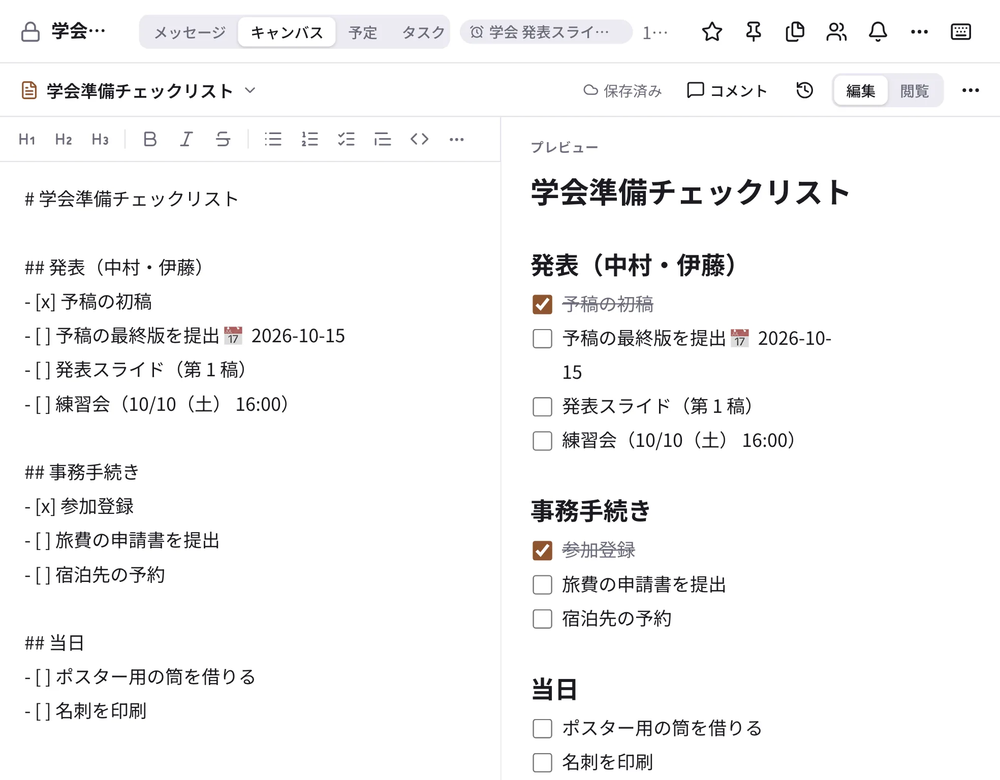

# キャンバス

キャンバスは、チャンネルや DM に付ける共有のメモです（Slack のキャンバスに近いものです）。学会準備のチェックリスト、
ミーティングの議題、決まったことのまとめなど、その会話の中で育てていく文書に向いています。研究室全体のマニュアルのように
長く残すものは [ドキュメント](docs.md) が向いています。

{ .wide }

## 使う

1. チャンネルの見出しの **「キャンバス」** タブを開きます。まだ無ければ「キャンバスを作成」を押します。
2. 「編集」で書きます。左に Markdown、右にプレビューが出ます。上のツールバーから見出し・太字・リスト・チェックリスト・表
   などを入れられます。
3. 入力は自動で保存されます。何人かで同時に書いても、サーバーがまとめます。誰が編集中かも表示されます。

- 1 つの会話に、キャンバスをいくつか作れます（題名の横の ⌄ で切り替え）。
- 版の履歴（🕘）で前の版を見たり戻したりでき、消したキャンバスはゴミ箱から戻せます。
- `@名前` でメンションすると、その人に通知が届きます。
- チェックリストの行の「タスクにする」で、その行からタスクを作れます。タスクを完了にすると、行にもチェックが付きます。
- サイドバーの「キャンバス」に、参加している会話のキャンバスが集まります。検索の「キャンバス」タブでも探せます。

スマートフォンでも読み書きできます（見出しごとか全体を編集）。
