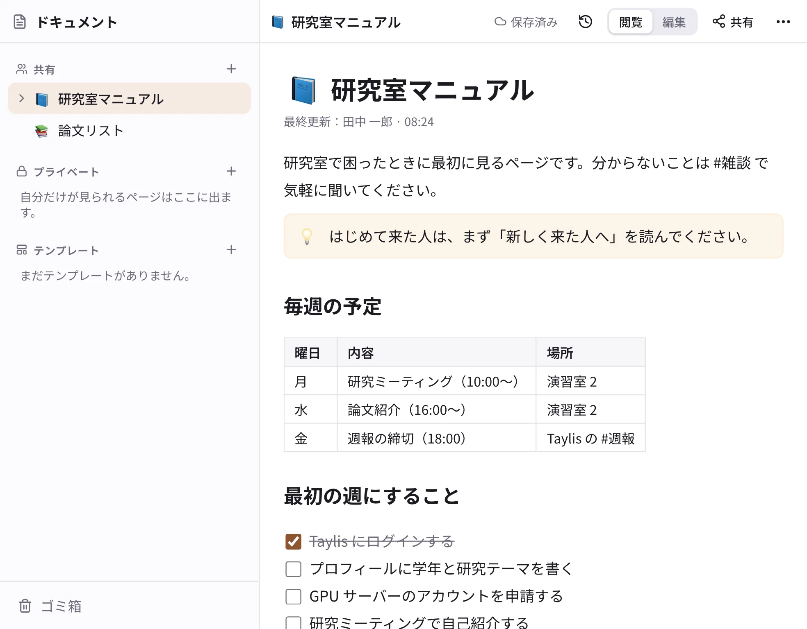
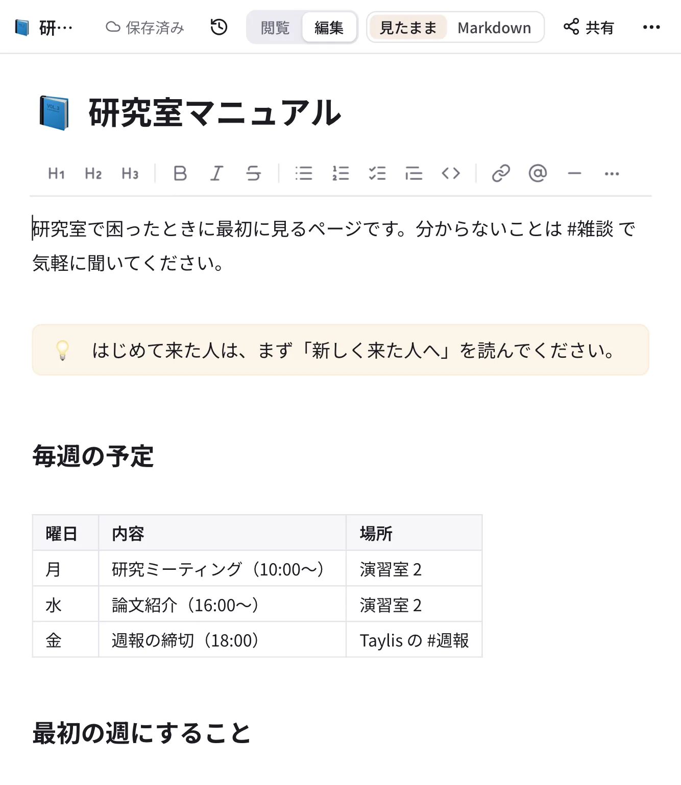
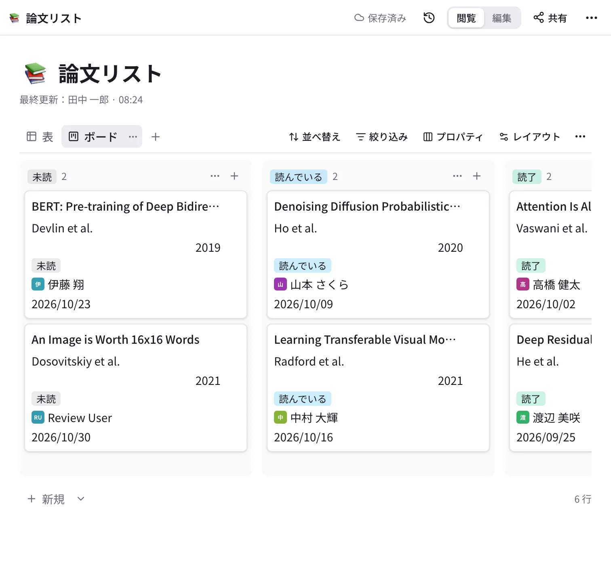

# ドキュメント

「ドキュメント」は、研究室のマニュアル・手順書・勉強会のノートなどを、ページの木にして残す場所です（Notion に近いものです）。
チャットに流れてしまう情報を、探しやすい形でまとめておけます。

{ .wide }

## ページを作る

1. サイドバーの「ドキュメント」を開きます。
2. 「共有」の ＋ で全員が読めるページ、「プライベート」の ＋ で自分だけのページを作ります。ページの ⋯ や ＋ から、
   その下に子ページを作れます。
3. 題名と本文を書きます。入力は約 2 秒ごとに自動で保存され、何人かで同時に書いてもサーバーがまとめます。

ページの並べ替えと移動は、左の木でドラッグします。消したページは 30 日間「ゴミ箱」から戻せます。

## 書く（見たまま編集）

{ .wide }

ページの右上の「編集」を押すと、書いたとおりの見た目のまま編集できます（デスクトップ版・ブラウザ版）。

- 行のはじめで `/` を打つと、見出し・リスト・チェックリスト・表・画像・コード・数式・コールアウト・トグル・子ページなどを
  選べます。
- `[[` でほかのページへのリンク、`@` で人へのメンションを入れられます（メンションされた人に通知が届きます）。
- Markdown で書きたい人は、右上の「見たまま」「Markdown」で切り替えられます（人ごとの設定）。
- 版の履歴（🕘）から、前の版を見たり戻したりできます。

スマートフォンでは、ページを読むのが基本で、見出しごとか全体を Markdown で編集できます。チェックリストはタップで付けられます。

## 共有する

ページの右上の **「共有」** で、読める人と書ける人を決めます。

| 段階 | できること |
| --- | --- |
| 閲覧 | 読む・検索・履歴を見る |
| 編集 | 本文を書く、子ページを作る、データベースの行を足す |
| フルアクセス | 上に加えて、共有の設定・移動・削除 |

相手には、ワークスペースの全員・グループ（例：`@m2`）・人を選べます。子ページは親の共有を受け継ぎ、子ページで人を
足すこともできます。**管理者でも、共有されていないページは読めません**。

## データベース

{ .wide }

データベースは、行の 1 つ 1 つがページになっている表です。論文リスト・備品の台帳・議事録の一覧などに使います。

1. 親にするページの ⋯ →「データベースを追加」で作ります（本文の `/` →「データベースを作って埋め込む」で、ページの中に置くこともできます）。
2. 列（プロパティ）の見出しの ＋ で、テキスト・数・選択・複数選択・日付・人・チェック・URL・関係などの列を足します。
3. 「＋ 新規」で行を足します。行を開くと、その行のページに本文を書けます。
4. 「表」の横の ＋ で、**ボード・リスト・ギャラリー・カレンダー** のビューを足せます。並べ替え・絞り込み・まとめる（グループ）
   も、ビューごとに保存されます。

## テンプレート

よく作るページ（議事録・実験ノートなど）は、左の「テンプレート」に置いておくと、新しいページを作るときに選べます。
データベースの行にも、既定のテンプレートを決められます。

Notion から移るときは、管理者が Notion の書き出しを取り込めます（[移行](../self-hosting/import.md)）。
