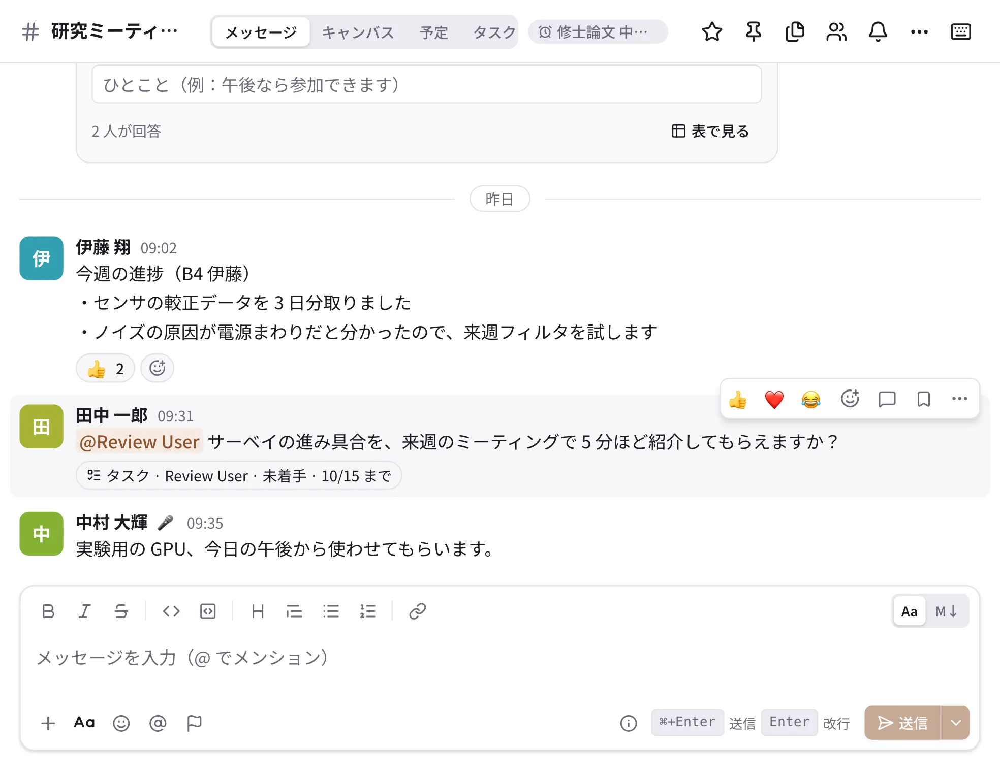
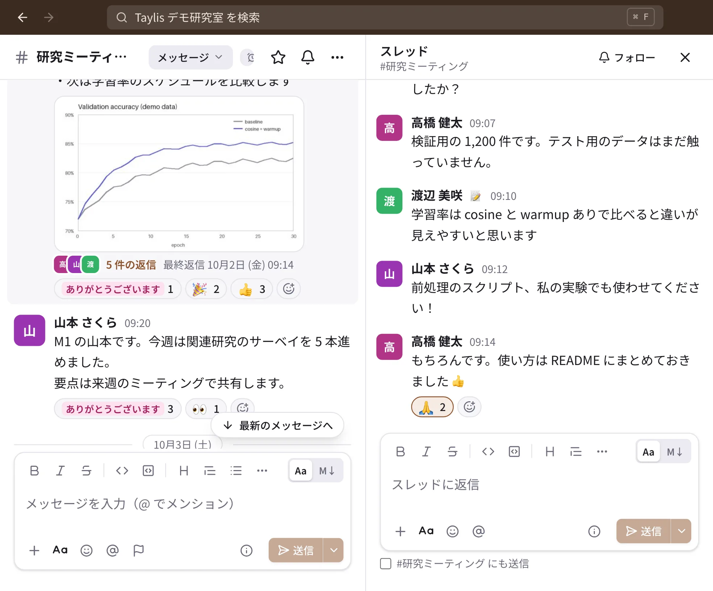

# メッセージとスレッド

{ .wide }

## メッセージを送る

1. サイドバーでチャンネルか DM を選びます。
2. 下の入力欄に書きます。`@` で人やグループをメンションでき、`:` で絵文字の候補が出ます。
3. 送信ボタンか、送信キーで送ります（既定はデスクトップ版が ++ctrl+enter++、macOS は ++cmd+enter++。設定 →「入力」で
   ++enter++ などに変えられます）。

太字や箇条書きなどの書き方は [メッセージの書き方](formatting.md) をご覧ください。

- 書きかけの文は **下書き** として保存され、ほかの端末でも続きを書けます。送っていない下書きは、サイドバーの「下書き」に
  出ます。
- 通信が切れていても送信は消えません。つながったときに送り直され、二重に届くことはありません。

### ファイルや写真を付ける

入力欄の ＋ →「写真・動画」または「ファイル」で選びます（デスクトップ版は入力欄にドラッグ、または貼り付けでも付けられます）。
1 つのメッセージに 10 個まで、1 ファイルの上限は既定で 100 MB です。PDF や Word・Excel・PowerPoint は、1 ページ目の
サムネイル付きで表示され、アプリの中で全ページを見られます。

### あとで送る（予約送信）

送信ボタンの右の ⌄ →「後で送信」で日時を選びます。送るまではサイドバーの「下書き」にあり、「今すぐ送信」や取り消しが
できます。

### 重要度と確認のお願い

入力欄の 🏳（重要度）で「重要」「緊急」の印や **「確認を求める」** を付けられます。確認を求めたメッセージには
「確認しました」のボタンが付き、誰が確認したか、まだの人が何人かを送った人が確かめられます。

## スレッドで返信する

{ .wide }

1. メッセージにポインタを合わせ（スマートフォンは長押しし）、💬「スレッドで返信」を押します。右にスレッドが開きます。
2. スレッドの入力欄に書いて送ります。
3. みんなに知らせたい返信は、入力欄の下の **「#チャンネル名 にも送信」** にチェックを入れると、チャンネルにも出ます。

返信したスレッドや、自分のメッセージに付いたスレッドは自動で **フォロー** され、新しい返信がサイドバーの「スレッド」と
[アクティビティ](activity.md) に届きます。スレッドの右上の「フォロー」で、フォローをやめたり始めたりできます。

## メッセージの操作

メッセージにポインタを合わせると出るボタンと、⋯（その他）のメニューから操作します。スマートフォンはメッセージを長押しします。

| 操作 | 内容 |
| --- | --- |
| ✏️ 編集 | 自分のメッセージを直します（空の入力欄で ++up++ でも）。直した後は「（編集済み）」と出て、編集の履歴も見られます |
| 🔖 あとで見る（保存） | サイドバーの「保存済み」に入れます |
| リマインド… | 決めた時刻に、そのメッセージを知らせてもらいます |
| リンクをコピー | メッセージへのリンク（`https://サーバー/m/…`）をコピーします |
| 別のチャンネルに共有… | ほかの会話にメッセージを引用して送ります |
| タスクにする | メッセージからタスクを作ります（[タスクと締切](tasks.md)） |
| レビューを依頼 | DM のメッセージ（論文の原稿など）の添削を相手に頼みます |
| チャンネルにピン留め | チャンネルの 📌 の一覧に残します |
| ここから未読にする | あとで読み直したいところに未読の印を戻します |
| 報告する | 不適切なメッセージを管理者に知らせます |
| 削除 | 自分のメッセージを消します（元に戻せません） |

## DM の整理

- **上に固定**：よく使う DM（自分だけの DM も）を、DM の一覧の先頭に固定できます。
- **会話を閉じる**：使わなくなった DM を一覧から隠します。新しいメッセージが来るか、自分で開くと戻ります。

どちらも DM の ⋯（会話の操作）か、一覧の右クリック（スマートフォンは長押し）から選びます。
