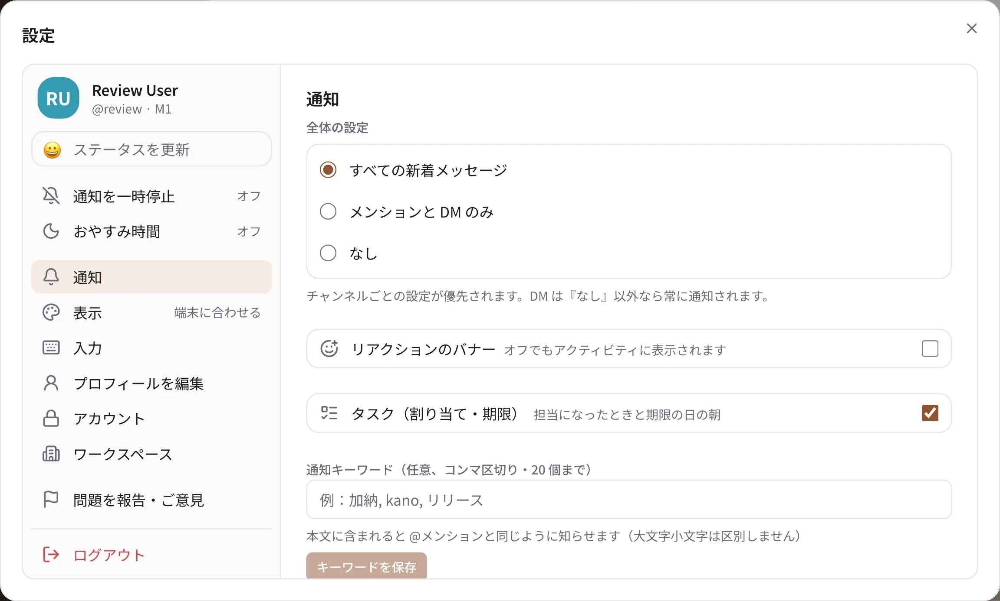

# 通知の設定

Taylis の通知は、端末の OS の許可と、Taylis の中の設定の両方で決まります。届かないときは、まず
[テスト通知](#test) で確かめてください。

## 端末ごとの準備

=== "iPhone / iPad"

    1. 初めてログインしたときに出る「通知を許可」で「許可」を選びます。
    2. 後から変えるときは、iPhone の「設定」→「通知」→「Taylis」で「通知を許可」をオンにします。
    3. 集中モードを使っているときは、Taylis を許可するアプリに入れておくと通知が届きます。

=== "Android"

    1. 初めてログインしたときに出る通知の許可で「許可」を選びます（Android 13 以降）。
    2. 後から変えるときは、「設定」→「アプリ」→「Taylis」→「通知」をオンにします。
    3. 省電力の設定で Taylis が止められていると遅れることがあります。

    プッシュ通知には Google Play 開発者サービスが必要です。

=== "macOS"

    1. デスクトップ版を初めて開いたときに出る通知の許可で「許可」を選びます。
    2. 後から変えるときは、「システム設定」→「通知」→「Taylis」で「通知を許可」をオンにします。

    デスクトップ版は、アプリが起動している間にサーバーからの知らせを受けて OS の通知を出します。
    スマートフォンのようなプッシュ通知ではないので、アプリを終了している間は届きません。

    ウィンドウを閉じても（閉じるボタン・⌘W）アプリは動き続け、通知は届きます。Dock の Taylis のアイコンを
    クリックするとウィンドウが戻ります。完全に終了するには ⌘Q（または Dock のアイコンを右クリック →「終了」）。

=== "Windows"

    1. 「設定」→「システム」→「通知」で、Taylis の通知をオンにします。
    2. 応答不可（集中モード）の間は通知が出ません。

    macOS と同じく、アプリが起動している間に通知を出します。

    ウィンドウを閉じても（閉じるボタン）アプリは通知領域（タスクバーの右端）で動き続け、通知は届きます。
    通知領域の Taylis のアイコンをクリックするとウィンドウが戻ります。完全に終了するには、そのアイコンを右クリックして
    「終了」を選びます。アイコンが見えないときは、通知領域の「^」（隠れているインジケーター）の中にあります。

=== "ブラウザ"

    ブラウザ版は、そのタブが開いている間だけ通知を出します。最初に表示される通知の許可で「許可」を選んでください。
    断ってしまったときは、アドレスバーの鍵のアイコンからサイトの設定を開いて通知を許可します。

## Taylis の中の設定

{ .wide }

設定（スマートフォンは「自分」）の「通知」で、次を決められます。

- **全体の設定**：「すべての新着メッセージ」「メンションと DM のみ」「なし」。DM とグループ DM は「なし」以外なら
  いつも通知されます。チャンネルごとの設定があれば、そちらが優先です。ほかの人の Times は、メンションのときだけ通知されます。
- **リアクションのバナー**：自分の投稿へのリアクションを通知のバナーで知らせるか（オフでもアクティビティには出ます）。
- **タスク（割り当て・期限）**：担当になったときと、期限の日の朝に知らせるか。
- **通知キーワード**：登録した言葉（コンマ区切り、20 個まで）を含むメッセージも、メンションと同じように通知されます。

### ウィンドウを閉じたとき（デスクトップ版）

設定 →「通知」→「この端末の通知」の **ウィンドウを閉じてもバックグラウンドで動かす**（既定はオン）をオフにすると、
ウィンドウを閉じたときにアプリも終了します（その後は通知が届きません）。端末ごとの設定です。

### 会話ごとの通知

チャンネルや DM の ⋯（詳細）から、その会話だけの通知を変えられます。

- 既定（全体の設定に従う）/ すべてのメッセージ / メンションのみ / 通知しない
- **ミュート**（解除するまで）と **8 時間ミュート**

### 通知を一時停止・おやすみ時間

- **通知を一時停止**：30 分・1 時間・2 時間・明日の 8:00 まで（または日時を指定して）、通知を止めます。
- **おやすみ時間**：毎日決まった時間帯（開始・終了・曜日）は通知しません。夜や週末の通知を止めるときに使います。

停止中は名前の横に 🔕 が付き、ほかの人からも「通知を一時停止中」と分かります。止めている間のメッセージも
未読として残るので、次に開いたときに読めます。

## 通知が来ないとき

次の場合、Taylis は通知を送りません（不具合ではなく仕様です）。

- 自分の投稿
- **別の端末で使っている間**（パソコンで操作しているときはスマートフォンに送りません）
- すでに読んだメッセージ
- その会話の通知が「通知しない」かミュート中、または通知の一時停止・おやすみ時間の間
- スレッドの返信で、自分がそのスレッドに参加（フォロー）していないとき

通知は「新しいメッセージがあるかもしれない」という合図です。通知が届かなくても、アプリを開けばサーバーから
最新の状態を取り寄せるので、メッセージがなくなることはありません。

## テスト通知を送る { #test }

設定（スマートフォンは「自分」）→「通知」→「テスト通知を送る」で、自分の端末に「テスト通知です。この端末に通知が
届いています。」という通知を送れます。端末ごとの結果が表示されます。

| 結果 | 意味と対処 |
| --- | --- |
| 送信しました | サーバーからは送れています。届かなければ、端末の OS の通知の許可を確かめてください |
| この端末に表示しました / アプリの起動中に表示 | デスクトップ版・ブラウザ版はプッシュを使わず、アプリが自分で通知を出します |
| プッシュ未登録 | 端末の通知がオフか、アプリをまだ開き直していません。通知を許可してアプリを開き直してください |
| このサーバでは iOS（Android）のプッシュが無効です | サーバーで APNs / FCM が設定されていません。管理者に伝えてください |
| 送れませんでした | 理由が表示されます。アプリを開き直すと端末の登録がやり直されます |

テスト通知は、ミュートや通知の一時停止に関係なく送られます（一時停止中ならそのことも表示されます）。
続けて送れるのは 5 回までで、その後は 2 分に 1 回です。
