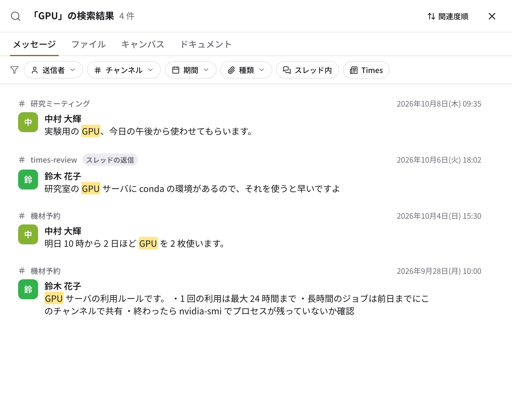

# 検索

{ .wide }

## 探す

1. いちばん上の検索欄（スマートフォンはホームの 🔍）に言葉を入れて ++enter++ を押します。
2. 結果の上のタブで、**メッセージ・ファイル・キャンバス・ドキュメント** を切り替えます。
3. 必要なら **送信者・チャンネル・期間・種類・スレッド内・Times** で絞り込みます。右上で「関連度順」と「新しい順」を
   切り替えられます。
4. 結果を押すと、そのメッセージの前後の会話が開きます。「検索結果に戻る」で結果に戻ります。

日本語と英語のどちらも、文の途中の言葉で見つかります（「較正」で「センサの較正データ」が見つかる、など）。読めるのは、
自分が参加している会話と公開チャンネルのものだけです。

## 検索の書き方

検索欄に、言葉と一緒に次のように書いても絞り込めます。

| 書き方 | 意味 |
| --- | --- |
| `from:@tanaka` | その人の投稿 |
| `in:#研究ミーティング` | そのチャンネル |
| `after:2026-10-01` / `before:2026-10-31` / `on:2026-10-05` | 期間 |
| `has:file` / `has:link` / `has:pin` / `has:reaction` / `has:poll` | ファイル・リンク・ピン留め・リアクション・アンケートのあるもの |
| `is:thread` / `is:times` | スレッドの返信だけ / Times の投稿だけ |

## 移動（⌘K）

チャンネル・DM・人・ドキュメントのページへすばやく移るには、++ctrl+k++（macOS は ++cmd+k++）か、サイドバーの「移動…」を
使います。名前の一部を打って ++enter++ で開きます。

## AI に聞く

管理者が AI を有効にしたワークスペースでは、検索の結果の上に **「AI に聞く」** が出て、見つかったメッセージをもとに
出典付きで答えてもらえます（[AI](ai.md)）。
