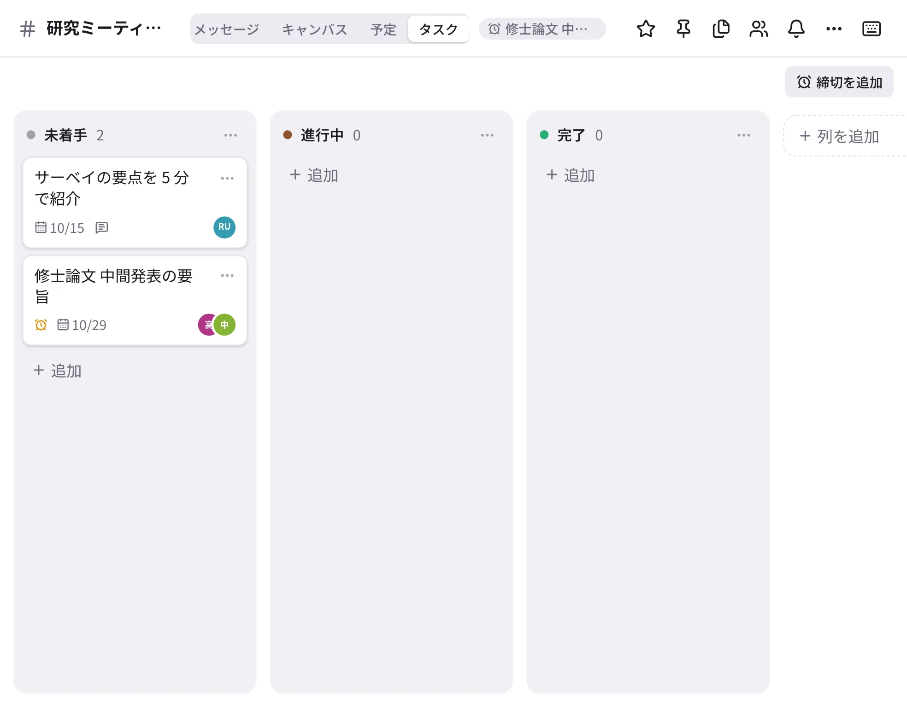

# タスクと締切

{ .wide }

## タスクの置き場所

| 場所 | 見られる人 | 開き方 |
| --- | --- | --- |
| 自分のタスク | 自分だけ | サイドバーの「タスク」 |
| チャンネルのボード | そのチャンネルのメンバー | チャンネルの見出しの「タスク」タブ |

サイドバーの「タスク」には、自分のタスクと、どのボードでも自分が担当になっているタスク、自分が頼んだタスクがまとまります。

## タスクを作る

1. サイドバーの「タスク」の「タスクを追加」、またはボードの列の「＋ 追加」を押します。
2. 題名を入れ、必要なら **担当者**（何人でも）・**期限**・メモ・サブタスク・繰り返しを決めます。
3. 保存します。担当者には通知が届き、期限の日の朝にも知らせが届きます。

**メッセージから作る**：メッセージの ⋯ →「タスクにする」。元のメッセージへのリンクが付きます。

**レビューを依頼**：DM で送った原稿などのメッセージの ⋯ →「レビューを依頼」で、相手に添削を頼むタスクを作れます。

## ボードを使う

- カードをドラッグして列を移ります（スマートフォンはカードの ⋯ から）。「完了」の列に入れると完了になります。
- 列の名前を変えたり、「＋ 列を追加」で列を足したりできます。
- タスクの期限は、[カレンダー](calendar.md) にも出ます。

## 締切

学会の原稿・申請書など、チャンネルみんなに関わる締切を登録すると、チャンネルの見出しに「あと 20 日」のように出ます。
7・3・1・0 日前には、チャンネルにお知らせが投稿されます。

1. チャンネルの ⋯ →「締切を追加…」（ボードの「締切を追加」でも）を選びます。
2. 題名と締切日を入れて保存します。

サイドバーの「締切」で、参加しているチャンネルの締切を近い順に見られます。
