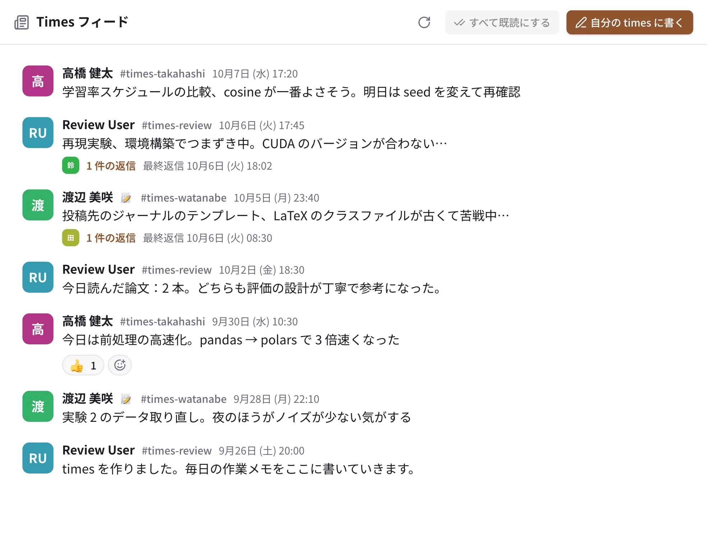

# Times

Times は、一人ひとりが持つ作業ログのチャンネル（`#times-名前`）です。今日やったこと、つまずいたこと、読んだ論文などを
気軽に書き、ほかの人はそれを眺めたり、スレッドで助言したりします。

{ .wide }

## 書く

1. サイドバーの「Times」の「フィード」を開き、右上の **「自分の times に書く」** を押します（まだ無ければ、ここで自分の
   times ができます）。
2. ふつうのチャンネルと同じように書いて送ります。

times の持ち主は、チャンネルの ⋯ →「他の人はスレッドでだけ返信できるようにする」で、ほかの人の書き込みをスレッドだけに
できます。

## 読む

- **フィード**：参加している times の投稿を、新しい順に 1 本の流れで読めます。
- ほかの人の times は、チャンネルを探すから参加すると、フィードに入ります。研究室の名簿で指導教員になっている人は、
  学生の times に自動で入ります。
- ほかの人の times は、**メンションされたときだけ** 未読と通知になります（静かな未読）。全部の投稿を知りたいときは、
  その times の通知を「すべて」にします。
- 検索で `is:times` と書くか、絞り込みの「Times」で、times の投稿だけを探せます。
