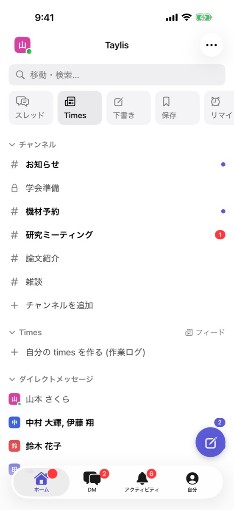
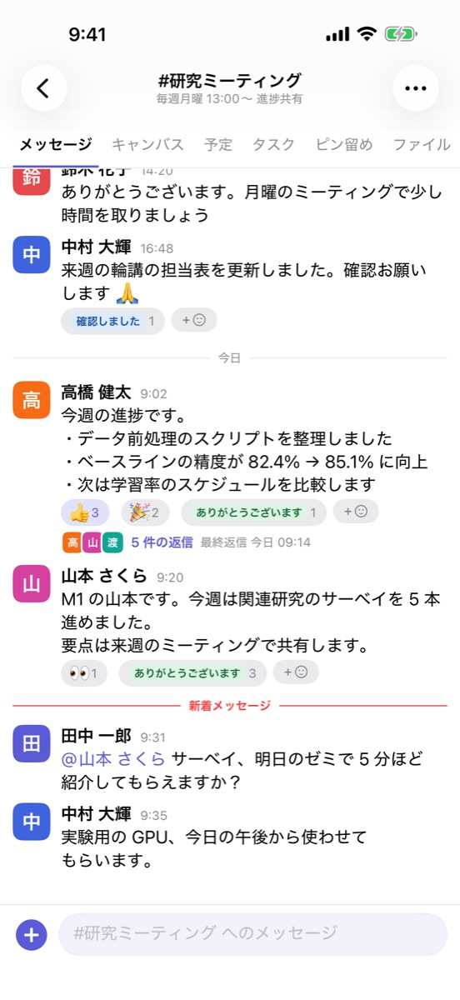
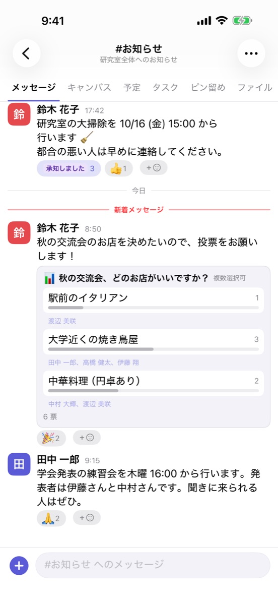

{ .hero-icon }

# Taylis

A self-hosted team chat for research labs and small teams

[Download](#download){ .md-button .md-button--primary }
[Run a server](self-hosting/index.md){ .md-button }
[GitHub](https://github.com/kanotown/taylis){ .md-button }

Taylis is a team chat for research labs, seminars and small organisations. Like Slack, it has channels, threads,
direct messages, reactions, search and file sharing.

You run the server yourself. Messages and files are stored on that server, and your organisation manages the
conversation history. There are apps for Windows, macOS, iOS and Android, and a browser client.

{ .wide }

{ .phone }
{ .phone }
{ .phone }

<small>All screenshots show fictional demo data. The user interface is currently in Japanese.</small>

## Highlights

-   :material-forum-outline:{ .lg } **Channels, DMs and threads**

    ---

    Public and private channels, direct and group messages, threads, mentions, reactions and pins. Your read
    position is synchronised between your computer and your phone.

-   :material-server-outline:{ .lg } **Self-hosted**

    ---

    One server with Docker Compose. All state lives in two places, PostgreSQL and a directory of files, and backup and
    restore scripts are included.

-   :material-check-decagram-outline:{ .lg } **Sync and push notifications**

    ---

    The server decides the message order, a retried send never creates a duplicate, and clients fetch what they
    missed after a reconnect. Push notifications go through APNs (iOS) and FCM (Android).

-   :material-magnify:{ .lg } **Japanese and English search**

    ---

    Full-text search with PostgreSQL + PGroonga, filtered by sender, channel and date.

-   :material-calendar-check-outline:{ .lg } **Tools for a lab**

    ---

    Polls and scheduling, calendars, tasks and boards, deadlines, canvases (shared documents), personal "times"
    channels, workflows and bookings for shared equipment or accounts.

-   :material-shield-account-outline:{ .lg } **Administration and import**

    ---

    Invitation links, sign-in with your organisation's Google accounts, guests, reports and blocking, in-app
    account deletion, and importers for Slack and Mattermost exports.

## Download { #download }

To use Taylis you need your organisation's Taylis server and an account created by its administrator. There is no
public sign-up in the apps.

| App | How to get it |
| --- | --- |
| Windows / macOS | Download the installer from [the GitHub releases (taylis-releases)](https://github.com/kanotown/taylis-releases/releases/latest). New versions can be installed from within the app. |
| iOS / iPadOS | Coming soon (App Store) |
| Android | Coming soon (Google Play) |
| Browser | Nothing to install: open your server's URL (for example `https://chat.example.com/`). |

To run your own server, see the [self-hosting quick start](self-hosting/quickstart.md). The source code is on
[GitHub (kanotown/taylis)](https://github.com/kanotown/taylis) under the Apache License 2.0.

!!! note "No support guarantee"
    Taylis is developed for the author's own use and published as-is. Issues and pull requests are welcome, but
    there is no promise of support, fixes or a roadmap.

The rest of this site (user guide, admin guide, how it works) is in Japanese; the
[design documents](https://github.com/kanotown/taylis/tree/main/docs) on GitHub are mostly in Japanese too.
