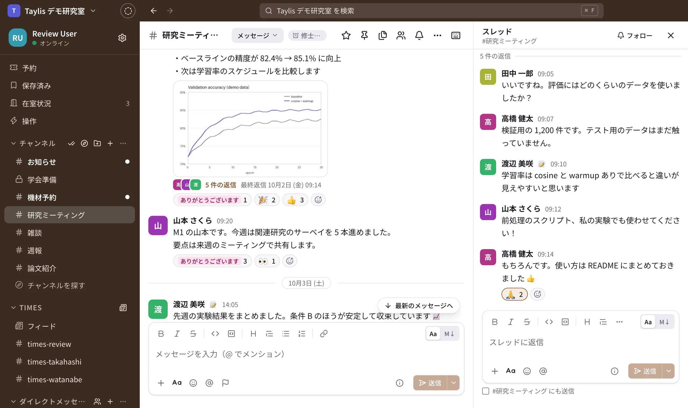

{ .hero-icon }

# Taylis（テイリス）

研究室や小さなチームのための、自分たちのサーバーで動かすチャット

[ダウンロード](#download){ .md-button .md-button--primary }
[サーバーを立てる](self-hosting/index.md){ .md-button }
[GitHub](https://github.com/kanotown/taylis){ .md-button }

Taylis は、研究室・ゼミ・小さなチームのためのチャットです。Slack と同じように、チャンネル・スレッド・DM・
リアクション・検索・ファイルの共有が使えます。

サーバーは自分たちで用意して動かします。メッセージやファイルはそのサーバーに保存され、会話の記録は自分たちで
管理します。アプリは Windows・macOS・iOS・Android 版と、ブラウザ版があります。

{ .full }

{ .phone }
{ .phone }
{ .phone }

<small>画面はすべて架空のデモのデータです。</small>

## 主な特徴

-   :material-forum-outline:{ .lg } **チャンネル・DM・スレッド**

    ---

    公開・非公開のチャンネル、DM とグループ DM、スレッド、メンション、リアクション、ピン留め。
    未読の位置はパソコンとスマートフォンの間で同期します。

-   :material-server-outline:{ .lg } **セルフホスト**

    ---

    Docker Compose で 1 台のサーバーに立てられます。データの置き場所は PostgreSQL とファイルのディレクトリの
    2 か所だけで、バックアップと復元のスクリプトも付いています。

-   :material-check-decagram-outline:{ .lg } **同期とプッシュ通知**

    ---

    メッセージの順番はサーバーが決め、送り直しても重複しません。通信が切れても、再接続のときに足りない分を
    取り寄せます。プッシュ通知は iOS（APNs）と Android（FCM）に対応しています。

-   :material-magnify:{ .lg } **日本語と英語の全文検索**

    ---

    PGroonga による全文検索で、日本語も英語も探せます。送信者・チャンネル・期間で絞り込めます。

-   :material-calendar-check-outline:{ .lg } **研究室で使う機能**

    ---

    ドキュメント（Wiki とデータベース）、アンケートと日程調整、カレンダー、タスクとカンバン、締切、キャンバス、
    Times（作業ログ）、ワークフロー、共有の機材の予約、在室状況。

-   :material-shield-account-outline:{ .lg } **管理と移行**

    ---

    招待リンク、組織の Google アカウントでのログイン、ゲスト、報告とブロック、アプリからのアカウント削除。
    Slack・Mattermost・Notion からの移行にも対応しています。

機能の全体は [機能](features.md) のページにまとめています。

## ダウンロード { #download }

Taylis を使うには、所属する組織の Taylis サーバーと、管理者が発行したアカウントが必要です。
アプリから新しく登録することはできません。

| アプリ | 入手方法 |
| --- | --- |
| Windows / macOS | [GitHub のリリース](https://github.com/kanotown/taylis/releases/latest) からインストーラをダウンロードしてください。アプリの中から新しい版に更新できます（[アプリを入れる](start/install.md)）。 |
| iOS / iPadOS | 準備中です（App Store での配信を準備しています） |
| Android | 準備中です（Google Play での配信を準備しています） |
| ブラウザ | インストールは要りません。サーバーの URL（例：`https://chat.example.com/`）をブラウザで開いてください。 |

サーバーを自分たちで立てる方法は [サーバーを立てる](self-hosting/index.md) にまとめています。
ソースコードは [GitHub（kanotown/taylis）](https://github.com/kanotown/taylis) で公開しています（Apache License 2.0）。

!!! note "サポートについて"
    Taylis は作者が自分たちで使うために開発し、そのままの形で公開しています。Issue やプルリクエストは歓迎しますが、
    対応・修正・今後の予定はお約束できません。

## はじめての方へ

- **使う人**：[はじめに](start/index.md) でアプリを入れてログインし、[使い方](guide/index.md) で分野ごとの操作を確かめてください。
- **管理者**：[管理者](admin/index.md) で、ユーザーの作成や招待、チャンネルや絵文字の管理を説明しています。
- **サーバーを用意する人**：[クイックスタート](self-hosting/quickstart.md) から始めてください。
- **仕組みが気になる人**：[仕組み](how-it-works/index.md) で、同期・通知・検索・セキュリティの考え方を紹介しています。
